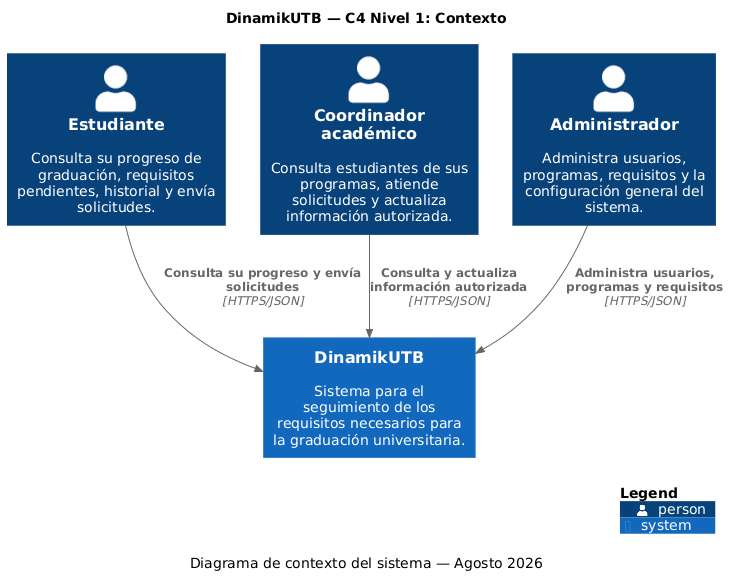

# 3. Context and Scope

Esta sección describe el contexto de DinamikUTB, sus usuarios principales y los límites del sistema.

DinamikUTB es una plataforma para el seguimiento de los requisitos necesarios para la graduación universitaria. El sistema centraliza la información necesaria para que los estudiantes puedan consultar su progreso y los usuarios autorizados puedan gestionar la información correspondiente.

---

## 3.1 Business Context

El contexto de negocio de DinamikUTB está compuesto principalmente por tres tipos de usuarios:

- **Estudiante**
- **Coordinador académico**
- **Administrador**

El sistema mantiene una relación diferente con cada uno de estos usuarios de acuerdo con sus responsabilidades.

### Estudiante

El estudiante es el usuario principal de DinamikUTB.

Utiliza el sistema para consultar su progreso hacia la graduación, conocer los requisitos que ha cumplido y visualizar aquellos que todavía están pendientes.

El estudiante podrá:

- Consultar su porcentaje de avance.
- Consultar sus requisitos de graduación.
- Identificar requisitos cumplidos y pendientes.
- Consultar información relacionada con créditos, idioma, prácticas, opción de grado y otros requisitos establecidos para su programa.
- Enviar solicitudes mediante el centro de ayuda cuando detecte una posible inconsistencia.

El estudiante **no modifica directamente su información académica**.

### Coordinador académico

El coordinador académico es un usuario autorizado responsable de gestionar y consultar información relacionada con los estudiantes de su programa académico.

Podrá:

- Consultar estudiantes pertenecientes a su programa.
- Gestionar los requisitos correspondientes a su programa académico.
- Atender solicitudes enviadas por estudiantes.
- Realizar modificaciones autorizadas sobre la información correspondiente.
- Consultar el historial de cambios relacionado con la información que gestiona.

El acceso del coordinador estará limitado a las responsabilidades y permisos definidos para su programa.

### Administrador

El administrador es un usuario con permisos generales sobre la plataforma.

Entre sus responsabilidades se encuentran:

- Crear y administrar las cuentas de los estudiantes.
- Gestionar usuarios y permisos.
- Crear y administrar programas académicos.
- Gestionar los requisitos asociados a los programas.
- Administrar la configuración general del sistema.
- Consultar información académica cuando sus permisos lo permitan.

El administrador tendrá un nivel de acceso superior al de los demás roles, debido a sus responsabilidades de administración del sistema.

---

## 3.2 System Scope

El objetivo de DinamikUTB es centralizar y facilitar el seguimiento de los requisitos necesarios para la graduación.

El sistema será responsable de:

- Gestionar la información de los requisitos de graduación.
- Asociar requisitos con los diferentes programas académicos.
- Mantener la información académica necesaria para realizar el seguimiento.
- Calcular el porcentaje de avance del estudiante.
- Determinar el estado de los requisitos.
- Identificar requisitos pendientes.
- Permitir la consulta de información según el rol del usuario.
- Gestionar solicitudes realizadas mediante el centro de ayuda.
- Mantener un historial de cambios relevantes.

El sistema utilizará una **base de datos propia** para almacenar la información necesaria.

En la primera versión, DinamikUTB **no será responsable de consultar directamente los sistemas académicos institucionales de la Universidad Tecnológica de Bolívar**.

---

## 3.3 Business Context Diagram

El siguiente diagrama representa el contexto de DinamikUTB y las interacciones principales entre el sistema y sus usuarios.

### Relaciones principales

| Actor | Interacción con DinamikUTB |
|---|---|
| **Estudiante** | Consulta su progreso, requisitos y porcentaje de avance; también puede enviar solicitudes mediante el centro de ayuda. |
| **Coordinador académico** | Consulta estudiantes de su programa, gestiona requisitos y atiende solicitudes. |
| **Administrador** | Administra usuarios, programas, requisitos y configuración general del sistema. |

---

## 3.4 Technical Context

DinamikUTB será inicialmente un sistema independiente que administrará su propia información mediante una base de datos propia.

No se contempla una integración directa con los sistemas académicos internos de la Universidad Tecnológica de Bolívar durante la primera versión.

### Componentes externos

Actualmente no se identifican sistemas externos necesarios para el funcionamiento básico de DinamikUTB.

La autenticación será gestionada por el propio sistema mediante las cuentas creadas previamente por el administrador.

El centro de ayuda también formará parte de DinamikUTB, por lo que no se considera un sistema externo.

### Base de datos

La información necesaria para el funcionamiento de DinamikUTB será almacenada en una base de datos propia.

La tecnología específica de la base de datos aún no ha sido definida y será seleccionada posteriormente como parte de las decisiones de arquitectura.

---

## 3.5 System Boundaries

El límite inicial del sistema comprende las siguientes responsabilidades:

**Dentro de DinamikUTB:**

- Autenticación y autorización.
- Gestión de usuarios.
- Gestión de roles.
- Gestión de programas académicos.
- Gestión de requisitos.
- Seguimiento del progreso académico.
- Cálculo del porcentaje de avance.
- Consulta de requisitos pendientes.
- Centro de ayuda.
- Historial de cambios.
- Almacenamiento de información en la base de datos propia.

**Fuera de DinamikUTB:**

- Sistemas académicos institucionales de la UTB.
- Fuentes externas de información académica.
- Procesos institucionales de matrícula, calificaciones u otros sistemas que no formen parte del alcance inicial.

Una futura versión podría incorporar integraciones con sistemas institucionales, siempre que se obtengan los permisos y mecanismos de acceso correspondientes.

---

## 3.6 Scope Decisions

El alcance inicial se establece de esta manera para mantener el proyecto realizable durante el semestre y, al mismo tiempo, demostrar una arquitectura que pueda evolucionar posteriormente.

La solución se diseñará para soportar diferentes programas académicos, aunque la incorporación completa de todos los programas y requisitos podrá realizarse progresivamente.

La arquitectura deberá permitir que una futura integración con sistemas institucionales pueda incorporarse sin modificar completamente la lógica principal del sistema.
