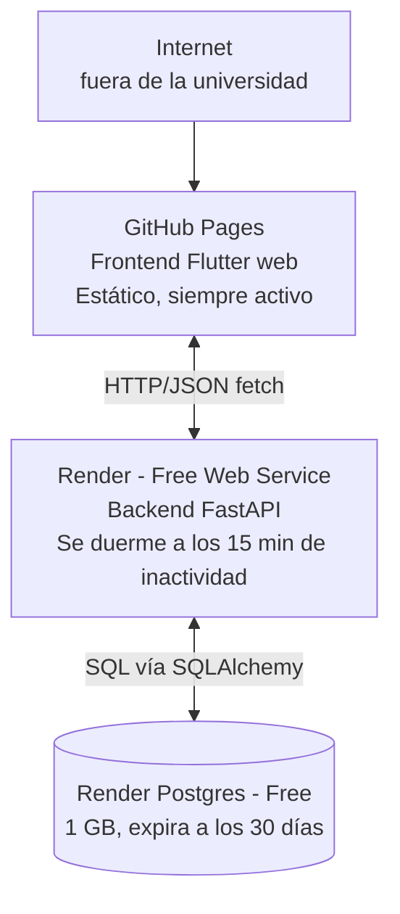

# 7. Deployment View

Esta sección describe dónde se ejecuta cada pieza de **DinamikUTB** en el ambiente desplegado, siguiendo las decisiones aceptadas en [ADR-0005](../adr/0005-plataforma-despliegue-backend.md) (backend y persistencia) y [ADR-0006](../adr/0006-plataforma-despliegue-frontend.md) (frontend).

> **Estado de implementación:** las decisiones de plataforma ya están aceptadas. Lo que queda pendiente es la ejecución del primer deploy real: la URL pública de cada pieza, los valores concretos de las variables de entorno (sección 7.3) y la fecha de creación de la base en Render Postgres todavía no están disponibles y se marcan como `<pendiente>` en este documento.

---

## 7.1 Infrastructure Level 1 — Vista general

Cada pieza se despliega y opera de forma independiente; ninguna comparte proceso ni sistema de archivos con otra.

| Pieza | Dónde corre | URL pública | Siempre activo | Costo mensual | ADR |
|---|---|---|---|---|---|
| Frontend (Flutter web) | GitHub Pages | `<pendiente>` | Sí (contenido estático) | $0 | [ADR-0006](../adr/0006-plataforma-despliegue-frontend.md) |
| Backend (FastAPI) | Render — Free Web Service | `<pendiente>` | No — *spin down* tras 15 min sin tráfico, ~1 min para reactivarse | $0, dentro de 750 h/mes | [ADR-0005](../adr/0005-plataforma-despliegue-backend.md) |
| Base de datos | Render Postgres (Free) | interna, no pública | Sí, mientras no expire | $0, expira a los 30 días de creada (14 días de gracia) — fecha de creación: `<pendiente>` | [ADR-0005](../adr/0005-plataforma-despliegue-backend.md) |
| Ficheros | No aplica | — | — | — | Ningún módulo sube archivos hoy |
| Trabajos programados | GitHub Actions (`schedule:`) | — | Se ejecuta según el cron configurado | $0 | Pendiente de un ADR propio cuando A-03 tenga código (ver [09-architecture-decisions.md](./09-architecture-decisions.md)) |
| Pipeline de CI | GitHub Actions | — | Se ejecuta en cada push/PR | $0 | Ya cubierto por la infraestructura existente (`ci.yml`) |

---

## 7.2 Justificación por escenario de calidad

| Escenario | Elemento de infraestructura | Cómo lo sostiene | ADR |
|---|---|---|---|
| [Q-01](./10-quality-requirements.md#escenario-q-01--exactitud-de-la-información-académica) | Render Postgres (Free) | Persiste los datos entre reinicios del backend; SQLite en el filesystem efímero de Render los habría perdido. | [ADR-0005](../adr/0005-plataforma-despliegue-backend.md) |
| [Q-03](./10-quality-requirements.md#escenario-q-03--facilidad-de-comprensión-de-la-información) | GitHub Pages | El frontend está siempre disponible sin latencia de arranque, para no confundir un *spin down* del backend con un error de la interfaz. | [ADR-0006](../adr/0006-plataforma-despliegue-frontend.md) |
| [Q-05](./10-quality-requirements.md#escenario-q-05--disponibilidad-del-sistema) | Backend en Render Free | Riesgo aceptado, no resuelto: el *spin down* de 15 minutos es una interrupción real documentada en [11-risks-and-technical-debt.md](./11-risks-and-technical-debt.md), asumida como consecuencia del límite de costo cero. | [ADR-0005](../adr/0005-plataforma-despliegue-backend.md) |
| [Q-04](./10-quality-requirements.md#escenario-q-04--alertas-tempranas-de-requisitos-pendientes) | GitHub Actions (`schedule:`) | Es la pieza donde correría, a futuro, el disparo periódico de alertas tempranas una vez A-03 tenga código. | Pendiente |

---

## 7.3 Secretos y configuración

| Variable | Propósito | Dónde debe vivir | Valor actual |
|---|---|---|---|
| Cadena de conexión a Render Postgres | Reemplaza el `SQLALCHEMY_DATABASE_URL` fijo hoy en `backend/app/core/database.py` | Variable de entorno del servicio en el dashboard de Render | `<pendiente>` |
| Orígenes permitidos de CORS | Reemplaza el comodín `allow_origins=["*"]` de `backend/app/main.py` por la URL exacta de GitHub Pages | Variable de entorno o configuración del servicio | `<pendiente>` |

> Ninguna de estas variables debe quedar escrita directamente en el código ni en `docs/`. Esta tabla se completa cuando el equipo tenga los valores reales del deploy.

## 7.4 Relación con otras vistas y documentos

- Los contenedores lógicos que aquí se ubican en infraestructura concreta están definidos en [05-building-block-view.md](./05-building-block-view.md) y en `docs/c4/contenedores.puml`.
- Las decisiones de plataforma están en [ADR-0005](../adr/0005-plataforma-despliegue-backend.md) y [ADR-0006](../adr/0006-plataforma-despliegue-frontend.md), indexadas en [09-architecture-decisions.md](./09-architecture-decisions.md).
- El límite de costo y la restricción de "sin tarjeta" que sustentan ambos ADR están registrados en [02-architecture-constraints.md](./02-architecture-constraints.md).
- Los riesgos que esta topología introduce (persistencia, disponibilidad, seguridad) están en [11-risks-and-technical-debt.md](./11-risks-and-technical-debt.md).
- Los aspectos sustentados por estas decisiones (A-01, A-04) están enlazados en [docs/aspectos.md](../aspectos.md).
