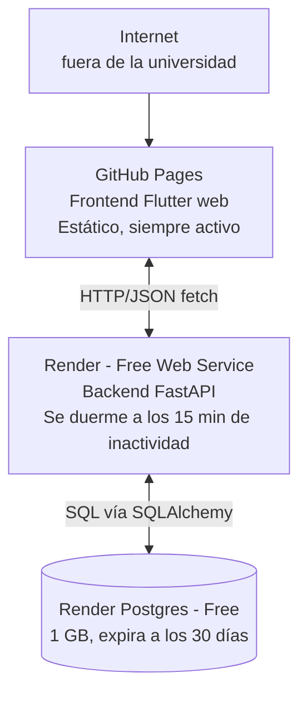

# 7. Deployment View

Esta sección describe dónde se ejecuta cada pieza de **DinamikUTB** en el ambiente desplegado, siguiendo las decisiones aceptadas en [ADR-0005](../adr/0005-plataforma-despliegue-backend.md) (backend), [ADR-0006](../adr/0006-plataforma-despliegue-frontend.md) (frontend) y [ADR-0007](../adr/0007-persistencia-render-postgres.md) (persistencia).

> **Estado de implementación:** la infraestructura está descrita como código (`render.yaml` y `.github/workflows/deploy-pages.yml`). Los valores marcados `<completar>` se rellenan con los datos reales tras el primer deploy.

---

## 7.1 Infrastructure Level 1 — Vista general

Cada pieza se despliega y opera de forma independiente; ninguna comparte proceso ni sistema de archivos con otra.

```mermaid
flowchart TD
    A[Internet<br>fuera de la universidad]
    B[GitHub Pages<br>Frontend Flutter web<br>Estático, siempre activo]
    C[Render - Free Web Service<br>Backend FastAPI<br>Se duerme a los 15 min de inactividad]
    D[(Render Postgres - Free<br>1 GB, expira a los 30 días)]

    A --> B
    B <-->|"HTTP/JSON fetch"| C
    C <-->|"SQL vía SQLAlchemy"| D
```

| Pieza | Dónde corre | URL pública | Siempre activo | Costo mensual | ADR |
|---|---|---|---|---|---|
| Frontend (Flutter web) | GitHub Pages | `https://iscoutb.github.io/AS_202620_DinamikUTB/` | Sí (contenido estático) | $0 | [ADR-0006](../adr/0006-plataforma-despliegue-frontend.md) |
| Backend (FastAPI) | Render — Free Web Service | `https://dinamikutb-api.onrender.com` (`/health`, `/metrics`) — confirmar tras el deploy | No — *spin down* tras 15 min sin tráfico, ~1 min para reactivarse | $0, dentro de 750 h/mes | [ADR-0005](../adr/0005-plataforma-despliegue-backend.md) |
| Base de datos | Render Postgres (Free) | interna, no pública | Sí, mientras no expire | $0, expira a los 30 días de creada (14 días de gracia) — fecha de creación: `<completar>` | [ADR-0007](../adr/0007-persistencia-render-postgres.md) |
| Ficheros | No aplica | — | — | — | Ningún módulo sube archivos hoy |
| Trabajos programados | GitHub Actions (`schedule:`) | — | Se ejecuta según el cron configurado | $0 | Pendiente de un ADR propio cuando A-03 tenga código (ver [09-architecture-decisions.md](./09-architecture-decisions.md)) |
| Pipeline de CI | GitHub Actions | — | Se ejecuta en cada push/PR | $0 | Cubierto por `ci.yml` |
| Análisis estático | SonarCloud | `https://sonarcloud.io/project/overview?id=ISCOUTB_AS_202620_DinamikUTB` | Sí | $0 | — |

El costo detallado, sus supuestos y el punto de ruptura de cada capa gratuita están en [docs/costos.md](../costos.md).

---

## 7.2 Justificación por escenario de calidad

| Escenario | Elemento de infraestructura | Cómo lo sostiene | ADR |
|---|---|---|---|
| [Q-01](./10-quality-requirements.md#escenario-q-01--exactitud-de-la-información-académica) | Render Postgres (Free) | Persiste los datos entre reinicios del backend; SQLite en el filesystem efímero de Render los habría perdido. | [ADR-0007](../adr/0007-persistencia-render-postgres.md) |
| [Q-03](./10-quality-requirements.md#escenario-q-03--facilidad-de-comprensión-de-la-información) | GitHub Pages | El frontend está siempre disponible sin latencia de arranque, para no confundir un *spin down* del backend con un error de la interfaz. | [ADR-0006](../adr/0006-plataforma-despliegue-frontend.md) |
| [Q-05](./10-quality-requirements.md#escenario-q-05--disponibilidad-del-sistema) | Backend en Render Free, `GET /health` y `GET /metrics` | Riesgo aceptado: el *spin down* de 15 minutos es una interrupción real ([11](./11-risks-and-technical-debt.md)). La métrica `dinamikutb_http_request_duration_seconds` y el contador `dinamikutb_http_requests_total` (por estado) permiten observar la latencia de arranque en frío y los errores 5xx. | [ADR-0005](../adr/0005-plataforma-despliegue-backend.md) |
| [Q-04](./10-quality-requirements.md#escenario-q-04--alertas-tempranas-de-requisitos-pendientes) | GitHub Actions (`schedule:`) | Es la pieza donde correría, a futuro, el disparo periódico de alertas tempranas una vez A-03 tenga código. | Pendiente |

---

## 7.3 Secretos y configuración

| Variable | Propósito | Dónde vive | Valor |
|---|---|---|---|
| `DATABASE_URL` | Cadena de conexión a la base. Sin definir, el backend usa SQLite local. | Inyectada por Render desde la base gestionada (`fromDatabase` en `render.yaml`). Nunca en el repositorio. | Secreto del proveedor |
| `CORS_ORIGINS` | Orígenes permitidos por CORS (lista separada por comas). | `render.yaml` (no es secreto: es un origen público) | `https://iscoutb.github.io` |
| `API_BASE_URL` | URL del backend que el frontend usa al compilar (`--dart-define`). | Variable de repositorio de GitHub Actions (opcional; tiene valor por defecto en `deploy-pages.yml`) | `https://dinamikutb-api.onrender.com` |
| `SONAR_TOKEN` | Autenticación del análisis de SonarCloud. | Secreto de GitHub Actions | Secreto del proveedor |

`.env.example` declara las variables del backend; `.env` está en `.gitignore`. Ninguna credencial se escribe en el código ni en `docs/`.

## 7.4 Relación con otras vistas y documentos

- Los contenedores lógicos que aquí se ubican en infraestructura concreta están definidos en [05-building-block-view.md](./05-building-block-view.md) y en `docs/c4/contenedores.puml`.
- Las decisiones de plataforma están en [ADR-0005](../adr/0005-plataforma-despliegue-backend.md), [ADR-0006](../adr/0006-plataforma-despliegue-frontend.md) y [ADR-0007](../adr/0007-persistencia-render-postgres.md), indexadas en [09-architecture-decisions.md](./09-architecture-decisions.md).
- El límite de costo y la restricción de "sin tarjeta" están en [02-architecture-constraints.md](./02-architecture-constraints.md); la estimación, en [docs/costos.md](../costos.md).
- Los riesgos que esta topología introduce están en [11-risks-and-technical-debt.md](./11-risks-and-technical-debt.md).
- Los aspectos sustentados (A-01, A-04) están en [docs/aspectos.md](../aspectos.md).
